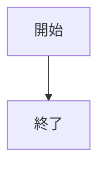
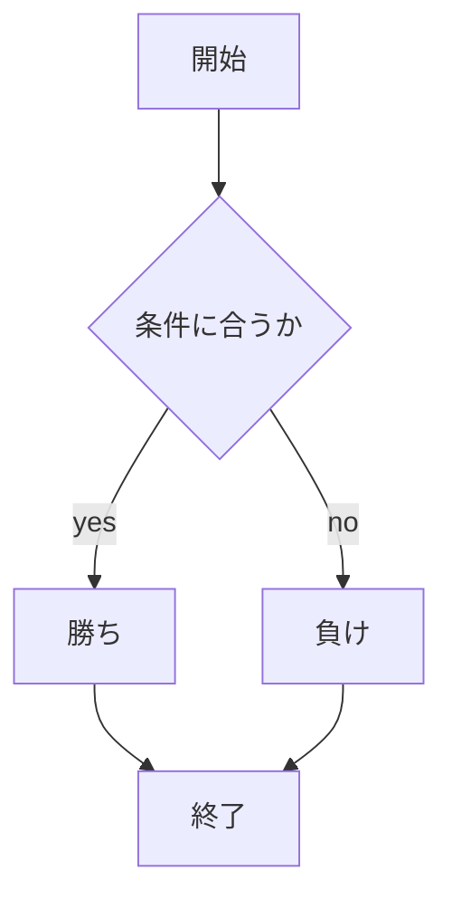
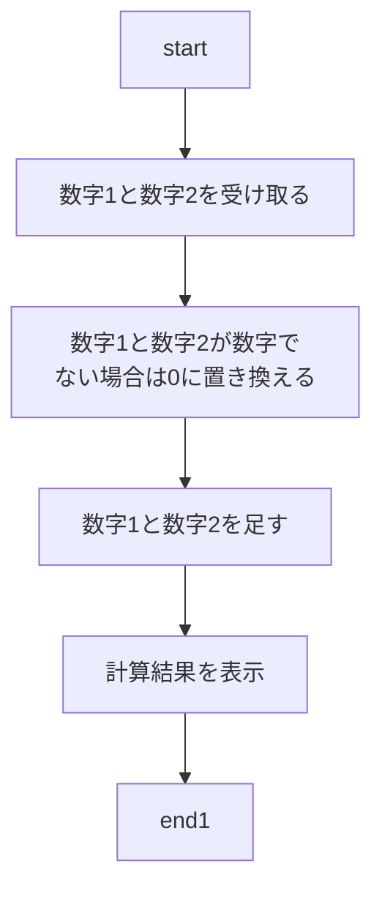

# webpro_06

## このプログラムについて

## ファイル一覧

ファイル名 | 説明
-|-
app5.js | プログラム本体
public/janken.html | じゃんけんの開始画面
public/calculator.html | 計算の開始前の画面
public/age.html | 年齢を入力する画面

```javascript
console.log( 'Hello' );
```

## 使用方法
｛jankenの場合｝
・```app5.js``` を起動する
・Webブラウザでlocalhost:8080/public/jankenにアクセスする
・自分の手を入力する





｛calculatorの場合｝
・```app5.js``` を起動する
・Webブラウザでlocalhost:8080/public/calculator.htmlにアクセスする
・数字1と数字2に好きな数字を入力し，計算するボタンがあるのでプッシュする
・機能としては，自分の好きな数字を2つ決め，その決めた数字を足し算してくれる




{ageの場合}
・```app5.js``` を起動する
・Webブラウザでlocalhost:8080/public/calculator.htmlにアクセスする
・自分の年齢を入力し，送信ボタンを押す
・機能としては，自分の年齢を入力したら，18歳未満の場合は「あなたは未成年です」と返答され，18歳以上65歳未満の場合は「あなたは成人です」と返答され，65歳以上の場合は「あなたは高齢者です」と返答される．